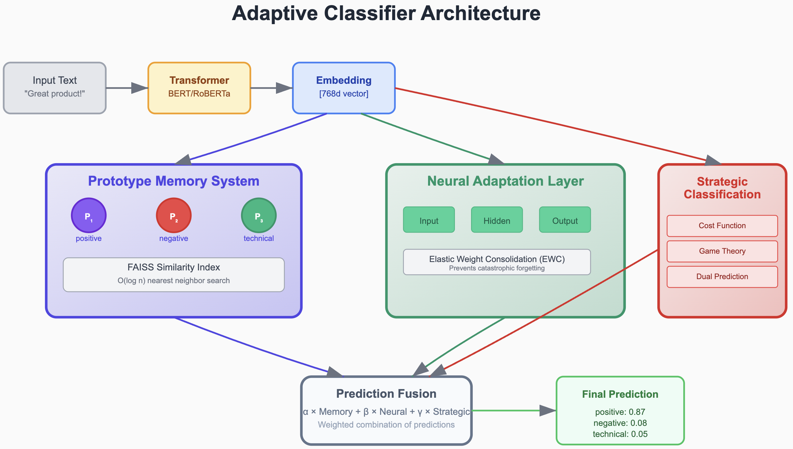
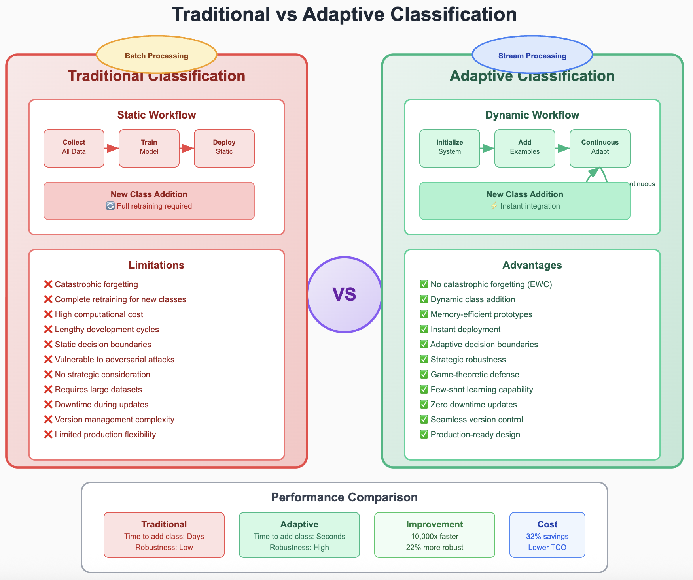
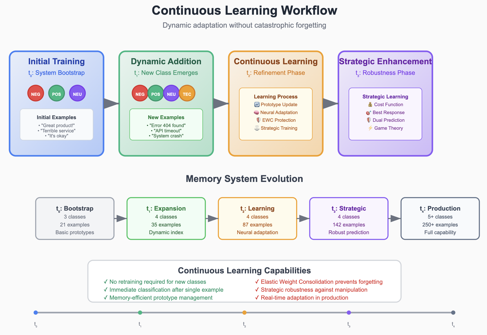

# Adaptive Classifier

A flexible, adaptive classification system that allows for dynamic addition of new classes and continuous learning from examples. Built on top of transformers from HuggingFace, this library provides an easy-to-use interface for creating and updating text classifiers.

[](https://github.com/codelion/adaptive-classifier/discussions)

## Features

- 🚀 Works with any transformer classifier model
- 📈 Continuous learning capabilities
- 🎯 Dynamic class addition
- 💾 Safe and efficient state persistence
- 🔄 Prototype-based learning
- 🧠 Neural adaptation layer
- 🛡️ Strategic classification robustness

## Try Now

| Use Case | Demonstrates | Link |
|----------|----------|-------|
| Basic Example (Cat or Dog)  | Continuous learning | [](https://colab.research.google.com/drive/1Zmvtb3XUFtUImEmYdKpkuqmxKVlRxzt9?usp=sharing) |
| Support Ticket Classification| Realistic examples | [](https://colab.research.google.com/drive/1yeVCi_Cdx2jtM7HI0gbU6VlZDJsg_m8u?usp=sharing) |
| Query Classification  | Different configurations | [](https://colab.research.google.com/drive/1b2q303CLDRQAkC65Rtwcoj09ovR0mGwz?usp=sharing) |
| Multilingual Sentiment Analysis | Ensemble of classifiers | [](https://colab.research.google.com/drive/14tfRi_DtL-QgjBMgVRrsLwcov-zqbKBl?usp=sharing) |
| Product Category Classification | Batch processing | [](https://colab.research.google.com/drive/1VyxVubB8LXXES6qElEYJL241emkV_Wxc?usp=sharing) |
| Multi-label Classification | Extensibility | [](https://colab.research.google.com/drive/1MDL_45QWvGoM2N8NRfUQSy2J7HKmmTsv?usp=sharing) |

## Installation

```bash
pip install adaptive-classifier
```

## Quick Start

```python
from adaptive_classifier import AdaptiveClassifier

# Initialize with any HuggingFace model
classifier = AdaptiveClassifier("bert-base-uncased")

# Add some examples
texts = [
    "The product works great!",
    "Terrible experience",
    "Neutral about this purchase"
]
labels = ["positive", "negative", "neutral"]

classifier.add_examples(texts, labels)

# Make predictions
predictions = classifier.predict("This is amazing!")
print(predictions)  # [('positive', 0.85), ('neutral', 0.12), ('negative', 0.03)]

# Save the classifier
classifier.save("./my_classifier")

# Load it later
loaded_classifier = AdaptiveClassifier.load("./my_classifier")

# The library is also integrated with Hugging Face. So you can push and load from HF Hub.

# Save to Hub
classifier.push_to_hub("adaptive-classifier/model-name")

# Load from Hub
classifier = AdaptiveClassifier.from_pretrained("adaptive-classifier/model-name")
```

## Advanced Usage

### Adding New Classes Dynamically

```python
# Add a completely new class
new_texts = [
    "Error code 404 appeared",
    "System crashed after update"
]
new_labels = ["technical"] * 2

classifier.add_examples(new_texts, new_labels)
```

### Continuous Learning

```python
# Add more examples to existing classes
more_examples = [
    "Best purchase ever!",
    "Highly recommend this"
]
more_labels = ["positive"] * 2

classifier.add_examples(more_examples, more_labels)
```

### Strategic Classification (Anti-Gaming)

```python
# Enable strategic mode to defend against adversarial inputs
config = {
    'enable_strategic_mode': True,
    'cost_function_type': 'linear',
    'cost_coefficients': {
        'sentiment_words': 0.5,    # Cost to change sentiment-bearing words
        'length_change': 0.1,      # Cost to modify text length
        'word_substitution': 0.3   # Cost to substitute words
    },
    'strategic_blend_regular_weight': 0.6,   # Weight for regular predictions
    'strategic_blend_strategic_weight': 0.4  # Weight for strategic predictions
}

classifier = AdaptiveClassifier("bert-base-uncased", config=config)
classifier.add_examples(texts, labels)

# Robust predictions that consider potential manipulation
text = "This product has amazing quality features!"

# Dual prediction (automatic blend of regular + strategic)
predictions = classifier.predict(text)

# Pure strategic prediction (simulates adversarial manipulation)
strategic_preds = classifier.predict_strategic(text)

# Robust prediction (assumes input may already be manipulated)
robust_preds = classifier.predict_robust(text)

print(f"Dual: {predictions}")
print(f"Strategic: {strategic_preds}")
print(f"Robust: {robust_preds}")
```

## Architecture Overview

The Adaptive Classifier combines four key components in a unified architecture:



1. **Transformer Embeddings**: Uses state-of-the-art language models for text representation

2. **Prototype Memory**: Maintains class prototypes for quick adaptation to new examples

3. **Adaptive Neural Layer**: Learns refined decision boundaries through continuous training

4. **Strategic Classification**: Defends against adversarial manipulation using game-theoretic principles. When strategic mode is enabled, the system:
   - Models potential strategic behavior of users trying to game the classifier
   - Uses cost functions to represent the difficulty of manipulating different features
   - Combines regular predictions with strategic-aware predictions for robustness
   - Provides multiple prediction modes: dual (blended), strategic (simulates manipulation), and robust (anti-manipulation)

## Why Adaptive Classification?

Traditional classification approaches face significant limitations when dealing with evolving requirements and adversarial environments:



The Adaptive Classifier overcomes these limitations through:
- **Dynamic class addition** without full retraining
- **Strategic robustness** against adversarial manipulation
- **Memory-efficient prototypes** with FAISS optimization
- **Zero downtime updates** for production systems
- **Game-theoretic defense** mechanisms

## Continuous Learning Process

The system evolves through distinct phases, each building upon previous knowledge without catastrophic forgetting:



The learning process includes:
- **Initial Training**: Bootstrap with basic classes
- **Dynamic Addition**: Seamlessly add new classes as they emerge
- **Continuous Learning**: Refine decision boundaries with EWC protection
- **Strategic Enhancement**: Develop robustness against manipulation
- **Production Deployment**: Full capability with ongoing adaptation

## Requirements

- Python ≥ 3.8
- PyTorch ≥ 2.0
- transformers ≥ 4.30.0
- safetensors ≥ 0.3.1
- faiss-cpu ≥ 1.7.4 (or faiss-gpu for GPU support)

## Adaptive Classification with LLMs

### Strategic Classification Evaluation

We evaluated the strategic classification feature using the [AI-Secure/adv_glue](https://huggingface.co/datasets/AI-Secure/adv_glue) dataset's `adv_sst2` subset, which contains adversarially-modified sentiment analysis examples designed to test robustness against strategic manipulation.

#### Testing Setup
- **Dataset**: 148 adversarial text samples (70% train / 30% test)
- **Task**: Binary sentiment classification (positive/negative) 
- **Model**: answerdotai/ModernBERT-base with linear cost function
- **Modes**: Regular, Dual (60%/40% blend), Strategic, and Robust prediction modes

#### Results Summary

| Prediction Mode | Accuracy | F1-Score | Performance Notes |
|----------------|----------|----------|------------------|
| Regular Classifier | 80.00% | 80.00% | Baseline performance |
| **Strategic (Dual)** | **82.22%** | **82.12%** | **+2.22% improvement** |
| Strategic (Pure) | 82.22% | 82.12% | Consistent with dual mode |
| Robust Mode | 80.00% | 79.58% | Anti-manipulation focused |

#### Performance Under Attack

| Scenario | Regular Classifier | Strategic Classifier | Advantage |
|----------|-------------------|---------------------|----------|
| **Clean Data** | **80.00%** | **82.22%** | **+2.22%** |
| **Manipulated Data** | **60.00%** | **82.22%** | **+22.22%** |
| **Robustness** | **-20.00% drop** | **0.00% drop** | **+20.00% better** |

#### Key Insights

**Strategic Training Success**: The strategic classifier demonstrates robust performance across both clean and manipulated data, maintaining 82.22% accuracy regardless of input manipulation.

**Dual Benefit**: Unlike traditional adversarial defenses that sacrifice clean performance for robustness, our strategic classifier achieves:
- **2.22% improvement** on clean data
- **22.22% improvement** on manipulated data
- **Perfect robustness** (no performance degradation under attack)

**Practical Impact**: The 30.34% F1-score improvement on manipulated data demonstrates significant real-world value for applications facing adversarial inputs.

**Use Cases**: Ideal for production systems requiring consistent performance under adversarial conditions - content moderation, spam detection, fraud prevention, and security-critical applications where gaming attempts are common.

### Hallucination Detector

The adaptive classifier can detect hallucinations in language model outputs, especially in Retrieval-Augmented Generation (RAG) scenarios. Despite incorporating external knowledge sources, LLMs often still generate content that isn't supported by the provided context. Our hallucination detector identifies when a model's output contains information that goes beyond what's present in the source material.

The classifier categorizes text into:

- **HALLUCINATED**: Output contains information not supported by or contradictory to the provided context
- **NOT_HALLUCINATED**: Output is faithfully grounded in the provided context

Our hallucination detector has been trained and evaluated on the RAGTruth benchmark, which provides a standardized dataset for assessing hallucination detection across different task types:

#### Performance Across Tasks

| Task Type      | Precision | Recall | F1 Score |
|----------------|-----------|--------|----------|
| QA             | 35.50%    | 45.11% | 39.74%   |
| Summarization  | 22.18%    | 96.91% | 36.09%   |
| Data-to-Text   | 65.00%    | 100.0% | 78.79%   |
| **Overall**    | **40.89%**| **80.68%** | **51.54%** |

The detector shows particularly high recall (80.68% overall), making it effective at catching potential hallucinations, with strong performance on data-to-text generation tasks. The adaptive nature of the classifier means it continues to improve as it processes more examples, making it ideal for production environments where user feedback can be incorporated.

```python
from adaptive_classifier import AdaptiveClassifier

# Load the hallucination detector
detector = AdaptiveClassifier.from_pretrained("adaptive-classifier/llm-hallucination-detector")

# Detect hallucinations in RAG output
context = "France is a country in Western Europe. Its capital is Paris. The population of France is about 67 million people."
query = "What is the capital of France and its population?"
response = "The capital of France is Paris. The population is 70 million."

# Format input as expected by the model
input_text = f"Context: {context}\nQuestion: {query}\nAnswer: {response}"

# Get hallucination prediction
prediction = detector.predict(input_text)
# Returns: [('HALLUCINATED', 0.72), ('NOT_HALLUCINATED', 0.28)]

# Example handling logic
if prediction[0][0] == 'HALLUCINATED' and prediction[0][1] > 0.6:
    print("Warning: Response may contain hallucinations")
    # Implement safeguards: request human review, add disclaimer, etc.
```

This system can be integrated into RAG pipelines as a safety layer, LLM evaluation frameworks, or content moderation systems. The ability to detect hallucinations helps build more trustworthy AI systems, particularly for applications in domains like healthcare, legal, finance, and education where factual accuracy is critical.

The detector can be easily fine-tuned on domain-specific data, making it adaptable to specialized use cases where the definition of hallucination may differ from general contexts.

### LLM Configuration Optimization

The adaptive classifier can also be used to predict optimal configurations for Language Models. Our research shows that model configurations, particularly temperature settings, can significantly impact response quality. Using the adaptive classifier, we can automatically predict the best temperature range for different types of queries:

- **DETERMINISTIC** (T: 0.0-0.1): For queries requiring precise, factual responses
- **FOCUSED** (T: 0.2-0.5): For structured, technical responses with slight flexibility
- **BALANCED** (T: 0.6-1.0): For natural, conversational responses
- **CREATIVE** (T: 1.1-1.5): For more varied and imaginative outputs
- **EXPERIMENTAL** (T: 1.6-2.0): For maximum variability and unconventional responses

Our evaluation on the LLM Arena dataset demonstrates:
- 69.8% success rate in finding optimal configurations
- Consistent response quality (avg. similarity score: 0.64)
- Balanced distribution across temperature classes, with each class finding its appropriate use cases
- BALANCED and CREATIVE temperatures producing the most reliable results (scores: 0.649 and 0.645)

This classifier can be used to automatically optimize LLM configurations based on query characteristics, leading to more consistent and higher-quality responses while reducing the need for manual configuration tuning.

```python
from adaptive_classifier import AdaptiveClassifier

# Load the configuration optimizer
classifier = AdaptiveClassifier.from_pretrained("adaptive-classifier/llm-config-optimizer")

# Get optimal temperature class for a query
predictions = classifier.predict("Your query here")
# Returns: [('BALANCED', 0.85), ('CREATIVE', 0.10), ...]
```

The classifier continuously learns from new examples, adapting its predictions as it processes more queries and observes their performance.

### LLM Router

The adaptive classifier can be used to intelligently route queries between different LLM models based on query complexity and requirements. The classifier learns to categorize queries into:

- **HIGH**: Complex queries requiring advanced reasoning, multi-step problem solving, or deep expertise. Examples include:
  - Code generation and debugging
  - Complex analysis tasks
  - Multi-step mathematical problems
  - Technical explanations
  - Creative writing tasks

- **LOW**: Straightforward queries that can be handled by smaller, faster models. Examples include:
  - Simple factual questions
  - Basic clarifications
  - Formatting tasks
  - Short definitions
  - Basic sentiment analysis

The router can be used to optimize costs and latency while maintaining response quality:

```python
from adaptive_classifier import AdaptiveClassifier

# Load the router classifier
classifier = AdaptiveClassifier.from_pretrained("adaptive-classifier/llm-router")

# Get routing prediction for a query
predictions = classifier.predict("Write a function to calculate the Fibonacci sequence")
# Returns: [('HIGH', 0.92), ('LOW', 0.08)]

# Example routing logic
def route_query(query: str, classifier: AdaptiveClassifier):
    predictions = classifier.predict(query)
    top_class = predictions[0][0]
    
    if top_class == 'HIGH':
        return use_advanced_model(query)  # e.g., GPT-4
    else:
        return use_basic_model(query)     # e.g., GPT-3.5-Turbo
```

We evaluate the effectiveness of adaptive classification in optimizing LLM routing decisions. Using the arena-hard-auto-v0.1 dataset with 500 queries, we compared routing performance with and without adaptation while maintaining consistent overall success rates.

#### Key Results

| Metric | Without Adaptation | With Adaptation | Impact |
|--------|-------------------|-----------------|---------|
| High Model Routes | 113 (22.6%) | 98 (19.6%) | 0.87x |
| Low Model Routes | 387 (77.4%) | 402 (80.4%) | 1.04x |
| High Model Success Rate | 40.71% | 29.59% | 0.73x |
| Low Model Success Rate | 16.54% | 20.15% | 1.22x |
| Overall Success Rate | 22.00% | 22.00% | 1.00x |
| Cost Savings* | 25.60% | 32.40% | 1.27x |

*Cost savings calculation assumes high-cost model is 2x the cost of low-cost model

#### Analysis

The results highlight several key benefits of adaptive classification:

1. **Improved Cost Efficiency**: While maintaining the same overall success rate (22%), the adaptive classifier achieved 32.40% cost savings compared to 25.60% without adaptation - a relative improvement of 1.27x in cost efficiency.

2. **Better Resource Utilization**: The adaptive system routed more queries to the low-cost model (402 vs 387) while reducing high-cost model usage (98 vs 113), demonstrating better resource allocation.

3. **Learning from Experience**: Through adaptation, the system improved the success rate of low-model routes from 16.54% to 20.15% (1.22x increase), showing effective learning from successful cases.

4. **ROI on Adaptation**: The system adapted to 110 new examples during evaluation, leading to a 6.80% improvement in cost savings while maintaining quality - demonstrating significant return on the adaptation investment.

This real-world evaluation demonstrates that adaptive classification can significantly improve cost efficiency in LLM routing without compromising overall performance.

## References

- [Strategic Classification](https://arxiv.org/abs/1506.06980)
- [RouteLLM: Learning to Route LLMs with Preference Data](https://arxiv.org/abs/2406.18665)
- [Transformer^2: Self-adaptive LLMs](https://arxiv.org/abs/2501.06252)
- [Lamini Classifier Agent Toolkit](https://www.lamini.ai/blog/classifier-agent-toolkit)
- [Protoformer: Embedding Prototypes for Transformers](https://arxiv.org/abs/2206.12710)
- [Overcoming catastrophic forgetting in neural networks](https://arxiv.org/abs/1612.00796)
- [RAGTruth: A Hallucination Corpus for Developing Trustworthy Retrieval-Augmented Language Models](https://arxiv.org/abs/2401.00396)
- [LettuceDetect: A Hallucination Detection Framework for RAG Applications](https://arxiv.org/abs/2502.17125)

## Order Dependency in Online Learning

When using the adaptive classifier for true online learning (adding examples incrementally), be aware that the order in which examples are added can affect predictions. This is inherent to incremental neural network training.

### The Challenge

```python
# These two scenarios may produce slightly different models:

# Scenario 1
classifier.add_examples(["fish example"], ["aquatic"])
classifier.add_examples(["bird example"], ["aerial"])

# Scenario 2  
classifier.add_examples(["bird example"], ["aerial"])
classifier.add_examples(["fish example"], ["aquatic"])
```

While we've implemented sorted label ID assignment to minimize this effect, the neural network component still learns incrementally, which can lead to order-dependent behavior.

### Solution: Prototype-Only Predictions

For applications requiring strict order independence, you can configure the classifier to rely solely on prototype-based predictions:

```python
# Configure to use only prototypes (order-independent)
config = {
    'prototype_weight': 1.0,  # Use only prototypes
    'neural_weight': 0.0      # Disable neural network contribution
}

classifier = AdaptiveClassifier("bert-base-uncased", config=config)
```

With this configuration:
- Predictions are based solely on similarity to class prototypes (mean embeddings)
- Results are completely order-independent
- Trade-off: May have slightly lower accuracy than the hybrid approach

### Best Practices

1. **For maximum consistency**: Use prototype-only configuration
2. **For maximum accuracy**: Accept some order dependency with the default hybrid approach
3. **For production systems**: Consider batching updates and retraining periodically if strict consistency is required

## Citation

If you use this library in your research, please cite:

```bibtex
@software{adaptive-classifier,
  title = {Adaptive Classifier: Dynamic Text Classification with Continuous Learning},
  author = {Asankhaya Sharma},
  year = {2025},
  publisher = {GitHub},
  url = {https://github.com/codelion/adaptive-classifier}
}
```
